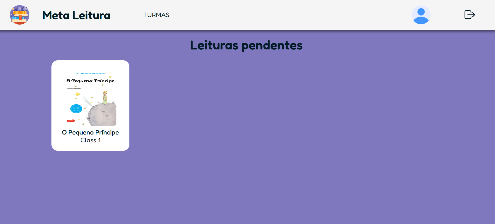
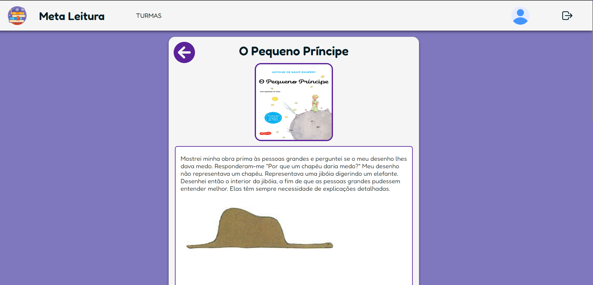
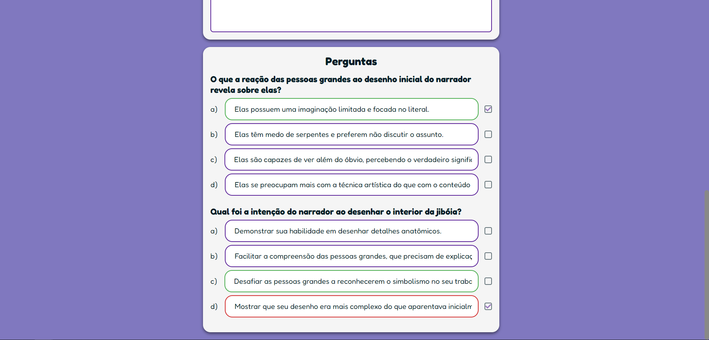
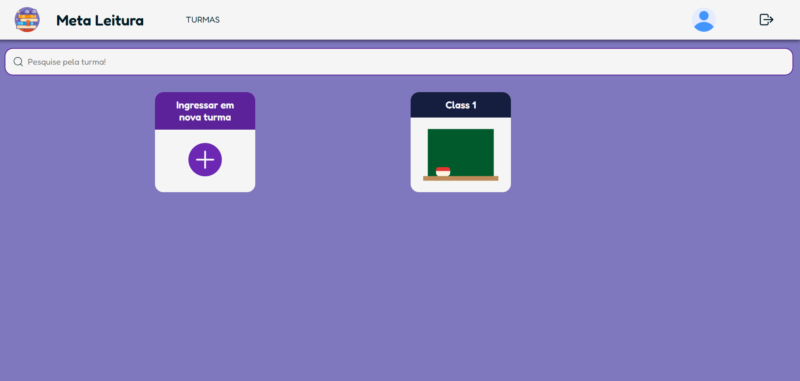
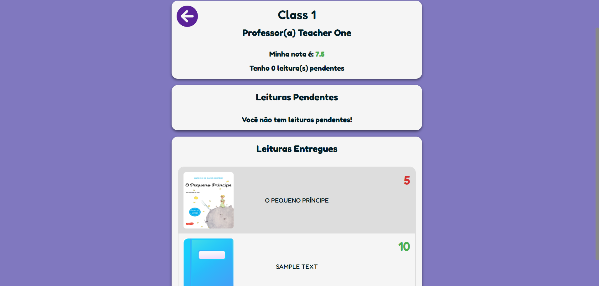

# Meta Reading 

Meta Reading is a social project developed as part of the Computer Science undergraduate course at UNIFESP. The project aims to enhance students' reading skills through a platform where teachers can upload texts and manage multiple classes with various students. Students must answer questions about the texts to earn grades and track their progress.

## Features 
 
- **Text Uploading** : Teachers can add various reading materials.
 
- **Class Management** : Create and manage multiple classes with different students.
 
- **Assessment** : Students answer questions about the texts to receive grades.

## Technologies Used 
 
- **Frontend** : Built with **Next.js 14**  using **Styled Components**  for styling.
 
- **Backend** : Utilizes the **APIs provided by Next.js 14**  for server-side logic.
 
- **Prisma** : ORM used for database interaction.
 
- **Docker** : Containerization tool to isolate the development environment.
 
- **ESLint** : Tool to ensure code quality and consistency.

## Screenshots

Here some exemples of how the project works:

### Login Page

### Student Home Page

### Student Task Part 1

### Student Task Part 2

### Student Class Page

### Student Class Details

## Publish

Temporarily, the application can be accessed by Render via the following URL:
[https://meta-reading-unifesp.onrender.com/](https://meta-reading-unifesp.onrender.com/)
